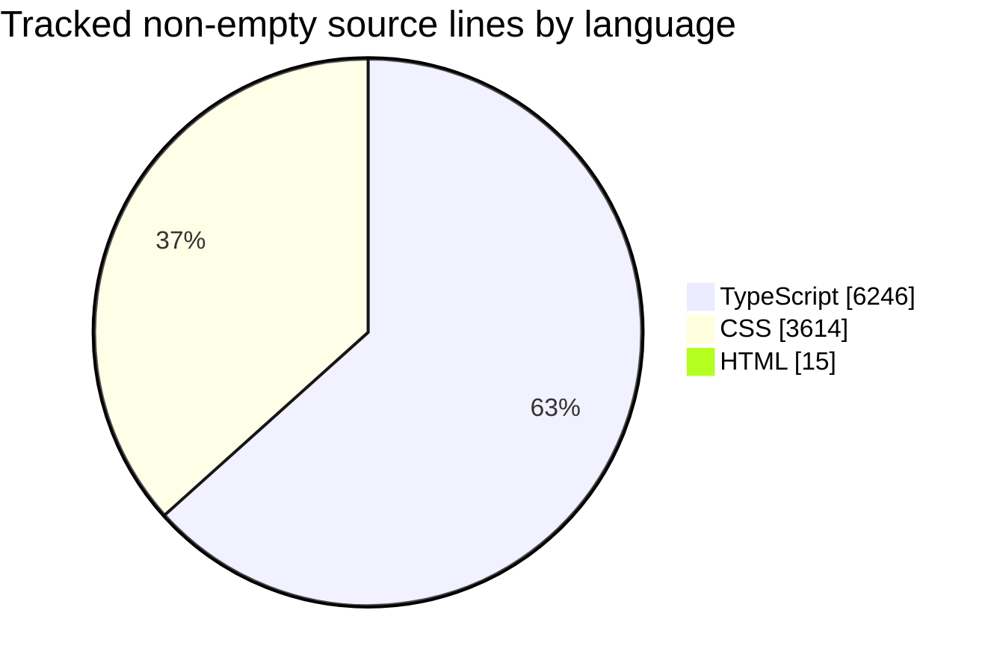

# PoEidler

Path of Exile-inspired idle/incremental game built with React, TypeScript, and Vite.

## Repository Stats
<!-- gitstats:start -->
> Last generated: 2026-03-13T15:37:08.4417979+01:00 via <code>npm run gitstats</code>

| Metric | Value |
| --- | ---: |
| Total commits | 33 |
| Contributors | 2 |
| Source files tracked | 52 |
| Total source lines | 11,222 |
| Non-empty source lines | 9,875 |
| Commits in last 30 days | 33 |
| First commit | 2026-03-12 |
| Latest commit | 2026-03-12 |

### Language Breakdown

### Top Contributors

| Contributor | Commits |
| --- | ---: |
| danko | 29 |
| Daniel Lesko | 4 |

### Largest Tracked Source Files

| File | Non-empty lines | Language |
| --- | ---: | --- |
| <code>src/styles/styles.css</code> | 3,614 | CSS |
| <code>src/game/maps.ts</code> | 781 | TypeScript |
| <code>src/game/upgradeEngine.ts</code> | 430 | TypeScript |
| <code>src/components/UpgradePanel.tsx</code> | 403 | TypeScript |
| <code>src/components/maps/MapPreparationPanel.tsx</code> | 403 | TypeScript |

### Recent Commits

- 2026-03-12 | danko | refactor: redesign upgrades screen layout
- 2026-03-12 | danko | refactor: improve scroll smoothness and render priority
- 2026-03-12 | Daniel Lesko | Merge pull request #2 from danda-n/codex/ui-architecture-performance
- 2026-03-12 | danko | refactor: optimize upgrade screen rendering
- 2026-03-12 | danko | refactor: optimize upgrade screen rendering
<!-- gitstats:end -->

## Development

- Install dependencies: <code>npm install</code>
- Start the Vite dev server: <code>npm run dev</code>
- Create a production build: <code>npm run build</code>
- Preview the production build locally: <code>npm run preview</code>
- Refresh the GitHub-facing repository stats in this README: <code>npm run gitstats</code>

## Notes

- The generated stats section in this README is based on the local git history in your checkout.
- Re-run <code>npm run gitstats</code> after meaningful history changes if you want the GitHub repo page to reflect updated counts.

