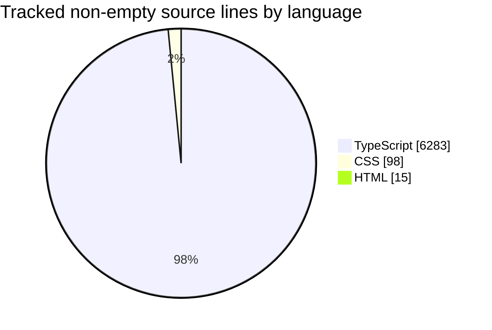

# PoEidler

Path of Exile-inspired idle/incremental game built with React, TypeScript, and Vite.

## Repository Stats
<!-- gitstats:start -->
> Last generated: 2026-04-01 via <code>npm run gitstats</code>

| Metric | Value |
| --- | ---: |
| Total commits | 71 |
| Contributors | 3 |
| Source files tracked | 64 |
| Total source lines | 7,161 |
| Non-empty source lines | 6,396 |
| Commits in last 30 days | 71 |
| First commit | 2026-04-01 |
| Latest commit | 2026-04-01 |

### Language Breakdown

### Top Contributors

| Contributor | Commits |
| --- | ---: |
| danko | 43 |
| Daniel Lesko | 26 |
| git stash | 2 |

### Largest Tracked Source Files

| File | Non-empty lines | Language |
| --- | ---: | --- |
| <code>src/game/maps.ts</code> | 781 | TypeScript |
| <code>src/game/upgradeEngine.ts</code> | 424 | TypeScript |
| <code>src/game/gameEngine.ts</code> | 315 | TypeScript |
| <code>src/components/maps/MapPreparationPanel.tsx</code> | 311 | TypeScript |
| <code>src/game/mapDevice.ts</code> | 289 | TypeScript |

### Recent Commits

- 2026-04-01 | Daniel Lesko | feat: UI/UX overhaul — compact rows, smart queue, map device, talent graph
- 2026-04-01 | Daniel Lesko | docs: add UI/UX overhaul plan "Less Is More"
- 2026-04-01 | Daniel Lesko | feat: settings full view, mobile bottom tab bar, update current-state
- 2026-04-01 | Daniel Lesko | refactor: delete replaced components, add nav unlock animations
- 2026-04-01 | Daniel Lesko | feat: add ProgressView with sub-tabs and dramatic prestige overlay
<!-- gitstats:end -->

## Development

- Install dependencies: <code>npm install</code>
- Start the Vite dev server: <code>npm run dev</code>
- Create a production build: <code>npm run build</code>
- Preview the production build locally: <code>npm run preview</code>
- Refresh the GitHub-facing repository stats in this README: <code>npm run gitstats</code>

## Notes

- The generated stats section in this README is based on the local git history in your checkout.
- Re-run <code>npm run gitstats</code> after meaningful history changes if you want the GitHub repo page to reflect updated counts.

